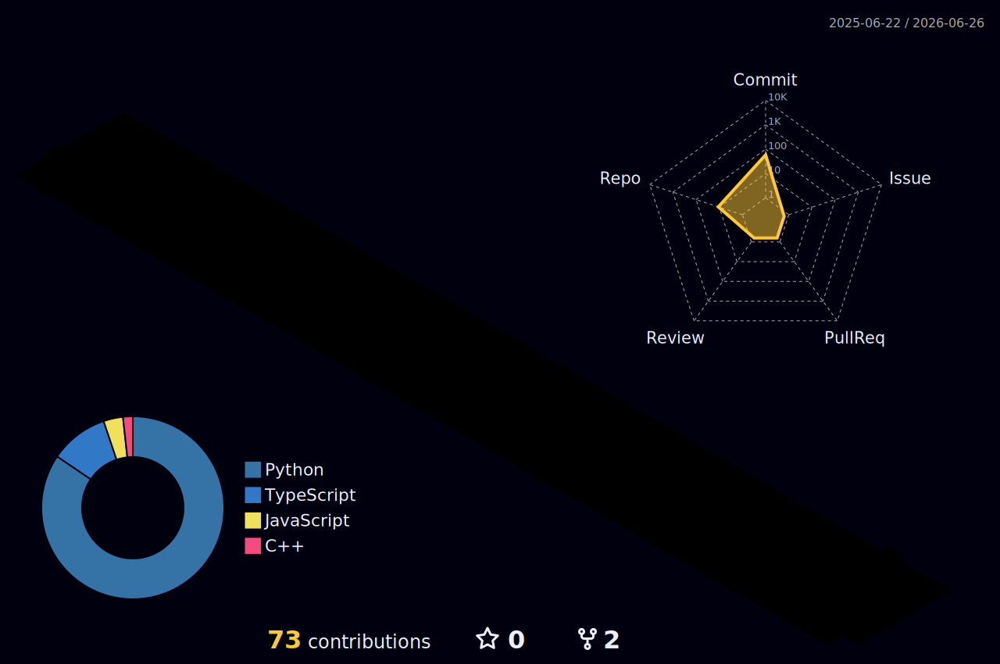

<div align="center">

<!-- CAPSULE RENDER ANIMATED HEADER -->


<!-- ANIMATED TYPING SVG -->
<a href="https://git.io/typing-svg">
  
</a>

<br/>

<!-- VISITOR COUNTER -->

&nbsp;


</div>

---

<!-- ABOUT ME — YAML-style, unique & professional -->
```yaml
name        : Shubh Gupta
alias       : titanShubh
college     : IET Lucknow, B.Tech CSE (2023–2027)
focus       : ["GenAI Engineering", "Multi-Agent Orchestration", "SDE", "Competitive Programming"]
building    : Multi-agent AI systems, RAG pipelines, LLM-powered apps
ask_me_about: ["LangChain", "LangGraph", "RAG", "Vector DBs", "DSA", "System Design"]
reach_me_at : [LinkedIn, LeetCode, Codeforces, CodeChef, AtCoder]
fun_fact    : "I treat every CP problem like a production bug 🐛"
status      : "Actively seeking GenAI & SDE internships/roles 🚀"
```

---

## 🧠 Tech Arsenal

<!-- AI/ML Stack -->
<div align="center">

**🤖 AI / GenAI & Agentic Systems**


**🗄️ Vector DBs & Storage**


**⚙️ Languages & SDE**


**🗃️ Databases & Caching**


**🛠️ Tools, Data & DevOps**


</div>

---

## 🏆 Competitive Programming

<div align="center">

| Platform | Profile | Rating & Level |
|:--------:|:-------:|:--------------:|
|  | [titanShubh](https://codeforces.com/profile/titanShubh) | 🔵 **Expert** (1794) |
|  | [guptashubh6386](https://leetcode.com/u/guptashubh6386/) | 🟡 **Guardian** (2245) |
|  | [titanShubh](https://www.codechef.com/users/titanShubh) | 🔶 **5-Star** |
|  | [titanShubh](https://atcoder.jp/users/titanShubh) | 🔵 **2 Kyu** Blue (1617) |

*Solved **2500+** algorithmic problems across platforms*

</div>

### 🎯 Key Contest Highlights
- 🏆 **Global Rank 38** in CodeChef Starters 169 (Rated, Division 2)
- 🏆 **Global Rank 199** in Codeforces Round 1029 (Div. 3)
- 🏆 **Global Rank 358** in LeetCode Weekly Contest 422 (26,000+ participants)
- 🏆 **Global Rank 2881** in Meta Hacker Cup 2024 (20,000+ participants globally)

<div align="center">
  
</div>

---

## ⏱️ This Week I Coded

<div align="center">
  
</div>

---

## 🚀 Key Projects

### 🤖 Multi-Agent Competitive Programming Coach
*Architected a stateful multi-agent system utilizing **LangGraph** and **LangChain**.*
- Deployed a central **Supervisor Agent** that dynamically routes queries across seven specialized nodes (Problem Analyzer, Complexity Analyzer, Learning Memory, etc.).
- Engineered an asynchronous **FastAPI** backend using **SQLModel** and **Server-Sent Events (SSE)** to stream structured reasoning logs with sub-100ms latency.
- Configured **Qdrant Cloud Vector Database** for semantic problem retrieval integrated with **PostgreSQL** for persistent tracking.

### 🌐 NexusAI — Enterprise Agentic Orchestration Platform
*A high-performance stateful multi-agent system designed for automated query routing.*
- Utilized **LangGraph** to analyze query intent and orchestrate execution across specialized SQL, RAG, and Python Pandas nodes.
- Built a secure, self-healing SQL executor using **SQLAlchemy 2.0** with an AST-based validator to prevent injections.
- Built a spreadsheet analytics sandbox utilizing **Pandas** and **Plotly** to render statistical charts dynamically.

### 🛡️ Network Sentinel — Full-Stack Security Assessment Platform
*A multi-threaded port scanner and real-time vulnerability analysis engine.*
- Engineered a socket-level host discovery engine using **ThreadPoolExecutor** in Python.
- Implemented bidirectional **WebSockets** communication to stream live scan telemetry and latencies to a React dashboard.
- Containerized the application stack (FastAPI, Nginx, SQLite, React) using **Docker Compose**.

---

## 📊 GitHub Stats

<div align="center">


<br/><br/>


</div>

---

## 🏆 GitHub Trophies

<div align="center">
  
</div>

<!-- 
### ⏱️ WakaTime Weekly Coding Stats
To activate your live WakaTime coding telemetry:
1. Sign up at https://wakatime.com and install the VS Code plugin.
2. Enable "Public Dashboard" in your settings.
3. Uncomment the image code below:

<p align="center">
  
</p>
-->

---

## 🐍 Contribution Snake

<div align="center">
  <picture>
    <source media="(prefers-color-scheme: dark)" srcset="https://raw.githubusercontent.com/titanShubh/titanShubh/output/github-snake-dark.svg" />
    <source media="(prefers-color-scheme: light)" srcset="https://raw.githubusercontent.com/titanShubh/titanShubh/output/github-snake.svg" />
    
  </picture>
</div>

<br/>

## 📊 3D Contribution Graph

<div align="center">
  
</div>

> ⚡ Auto-updates daily via GitHub Actions

---

## 🤝 Connect With Me

<div align="center">

[](https://www.linkedin.com/in/shubh-gupta-2ab23a280/)
[](https://leetcode.com/u/guptashubh6386/)
[](https://codeforces.com/profile/titanShubh)
[](mailto:guptashubh926@gmail.com)
[](https://github.com/titanShubh)

</div>

---

<!-- ACTIVITY GRAPH -->
<div align="center">
  
</div>

---

<!-- CAPSULE RENDER FOOTER -->
<div align="center">
  
</div>

<div align="center">
  <i>⚡ "The best way to predict the future is to build it with AI." — titanShubh</i>
</div>
